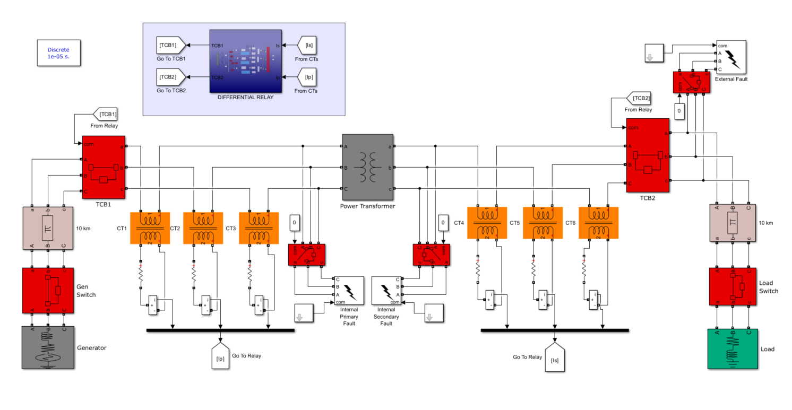

## Introduction
Power transformers are widely used in most high voltage substations. In view of that,
power transformers are manufactured to be efficient and highly robust, thus offering a
very high degree of reliability. But like any other machine, they are vulnerable to faults,
which if left unmonitored, undetected and undiagnosed, might lead to catastrophic failure
of the machine in the long run. Faults that are generated in the windings of the power
transformer called internal faults are the most common faults constituting about 34% of all
faults that occur on the power transformer. Therefore, they require an intelligent and
technical means of protection. Hence in this work, pattern recognition approaches such as
Discrete Wavelet Transformer (DWT) and Adaptive Neuro-Fuzzy Inference System
(ANFIS) were used as means of protection to detect, diagnose and classify internal faults
as well as discriminate them from transient phenomenon such as inrush currents, thus
improving the operational effectiveness of the power transformer. In achieving this, a
series of simulations were performed in MATLAB/Simulink on a 3-phase power
transformer model working under different conditions. This model was designed based on
the parameters of a real power transformer installed at the Ghana Grid Company Limited
(GRIDCo), Volta substation. During each simulation of a particular working condition of
the power transformer, the differential current for each phase was calculated and fed to the
intelligence unit of a designed differential relay. The intelligence unit is a combination of
the DWT and the ANFIS algorithms. The DWT algorithm first detected and diagnosed the
differential currents whiles the ANFIS algorithm classified the differential currents into
their respective working conditions such as healthy, inrush, external fault or internal fault.
The results obtained indicated that the DWT and ANFIS techniques accurately detected,
diagnosed and classified the simulated faults with 100% success rate and 91.5% accuracy
at a speed of 3.5 ms. This was the key finding of the research since a differential relay
operating under such a high speed has not been reported in literature. Hence, when this
work is successfully implemented in the construction of differential relays, it will help
improve the reliability and operational speed of differential relays, thus preventing false
tripping and catastrophic failure of power transformers. It is therefore recommended that,
larger dataset obtained through laboratory experiments should be considered as a
substitute for the data used in this work which was obtained through simulation
experiments. Future work should therefore consider prediction of fault location on power
transmission lines using DWT and ANFIS.

## Model
